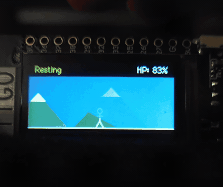

# Stick Man: An Embedded Critique of College Grind Culture

*A generative embedded art installation exploring overwork, burnout, and restorative rest on the ESP32.*

- **Course:** COMS BC3930: Creative Embedded Systems, Columbia University / Barnard College
- **Author:** Akito Yamauchi
- **Repository:** [github.com/akt-y/Creative_Embedded_Design](https://github.com/akt-y/Creative_Embedded_Design)
- **Target Hardware:** LilyGO TTGO T-Display (ESP32, ST7789 240×135 IPS Display, LiPo Battery)
- **Installation Date:** October 1–2, 2026 (Milstein Center 516 / Sulzberger Lab)

---

## 1. Artistic Vision: The Illusion of Progress

In collegiate life—particularly within high-intensity environments like Columbia—a pervasive "grind culture" equates constant motion with moral and academic virtue. Pulling an all-nighter or overloading on credits is frequently discussed as a badge of honor. We celebrate the appearance of speed: frantic typing, late-night library sessions, and perpetual busyness. Yet in this race, we routinely conflate velocity with progress, ignoring the profound physiological and mental depletion silently accumulating beneath the surface.

For Module 1 of Creative Embedded Systems, the assignment challenged us to create a generative, code-driven visual piece powered by a LiPo battery and installed inside an envelope hanging in the Milstein Center. Hanging an electronic artwork inside a college library—a building where students study around the clock—offered a unique opportunity for site-specific commentary.

I wanted to design an installation that makes the viewer directly complicit in the cycle of overwork:



The installation presents a solitary stick figure moving through a landscape. By default, the figure walks at a sustainable pace, taking in a vibrant twilight sky and lush mountains while gradually rebuilding stamina. However, the viewer is invited to interact via an exposed capacitive touch wire connected to GPIO32.

When touched, the figure reacts to this external pressure: it leans into a dead sprint ("Grinding"), and the mountain scenery rushes by twice as fast. To an outside observer, the student appears highly productive. But internally, the figure's energy (HP) drains relentlessly. If the viewer continues to hold the wire, the figure crosses a threshold into "Burnout" ($\le 30\%$ HP), limping as the vibrant sky and mountains drain into gloomy charcoal. If pressure is sustained to zero, the figure collapses flat on the ground into a pitch-black void ("Collapsed").

The ethical realization embedded in the piece is simple: **the only way to save the student is intentional non-intervention and rest.** The viewer must actively choose to let go.

---

## 2. Key Design Decisions

Throughout development, several deliberate choices shaped the interaction and visual aesthetic:

### Procedural Geometry over Static Bitmaps
The course specification explicitly demanded generative art driven by code rather than cycling pre-rendered GIFs or static images. I constructed the visual world entirely from mathematical drawing primitives (`fillTriangle`, `drawCircle`, `drawLine`, `drawFastHLine`). The mountain peaks, snow caps, running cadence, and horizon line are computed and drawn procedurally each frame. This approach gives the artwork dynamic responsiveness and keeps memory usage negligible.

### The Mountain as a Sisyphus Metaphor
Rather than drawing literal academic props like textbooks or library desks, which easily appear cluttered on a 240×135 pixel screen, I chose parallax scrolling mountains. The mountains evoke the myth of Sisyphus: an infinite, repetitive uphill climb where summiting one peak only exposes the next slope. Because the mountains scroll with sub-pixel offsets proportional to the stick figure's running speed, rapid sprinting makes the milestones blur past, yet the horizon never gets any closer.


### Environmental Desaturation Across Four Stages
Burnout is not just an internal feeling; it alters how one perceives the world. To convey this, the color palette shifts across four discrete psychological states:

| Stage | Trigger Condition | Visual Appearance | Movement |
|---|---|---|---|
| **Resting** | Touch released, $\text{HP} > 30\%$ | Vibrant twilight sky (`0x22F5`), lush forest green mountains (`0x2408`), white snow caps | Steady walking (2 px/frame), white figure |
| **Grinding** | Touch active, $\text{HP} > 30\%$ | Faded dusty slate sky (`0x324A`), muted grey-brown mountains (`0x4226`) | Rapid sprint (4 px/frame), warning yellow figure |
| **Burnout** | Any state, $\text{HP} \le 30\%$ | Overcast charcoal gloom (`0x18C3`), dark grey silhouette mountains (`0x2104`) | Exhausted limp (1 px/frame), strained orange figure |
| **Collapsed** | Energy depleted, $\text{HP} \le 0\%$ | Absolute pitch black void (`0x0000`), faint shadow silhouettes | Motionless (0 px/frame), flatline red figure |

### Asymmetric Energy Mechanics
In real life, burnout accumulates swiftly under stress, while recovery is slow and fragile. I structured the energy dynamics to reflect this asymmetry:
- Normal touch drains energy at `0.30` HP per frame (~11 seconds from full health to collapse).
- If the student is already in Burnout, additional touch punishes them severely, draining `1.00` HP per frame.
- Conversely, resting recovers energy at `0.10` HP per frame when healthy, but crawls at just `0.03` HP per frame while in Burnout.
- Once in Burnout, climbing back above 30% requires patience and extended, uninterrupted rest.

### The Cynicism of the Reset Button
When the figure collapses, pressing the onboard pushbutton (GPIO0) revives the character back to 100% HP and restores the vibrant colors. This design choice mirrors university coping mechanisms: after collapsing from exhaustion, students often treat a short break or caffeine as a quick reset button to jump right back into the grind, perpetuating the very cycle that caused the crash.

---

## 3. Technical Challenges and Solutions

Building this interactive piece within the hardware limits of the ESP32 TTGO T-Display involved several practical engineering challenges:

### 1. Capacitive Touch Noise and Dynamic Calibration
The ESP32 features built-in capacitive touch sensing on several ADC pins via `touchRead()`. However, the raw readings fluctuate significantly depending on ambient humidity, grounding, whether the board is running on battery versus USB, and whether the viewer is already holding the wire when the device boots.

To resolve this, I implemented an auto-calibration routine in `setup()`:
```cpp
void calibration() {
  tft.fillScreen(TFT_BLACK);
  tft.setTextDatum(MC_DATUM);
  tft.setTextColor(TFT_YELLOW, TFT_BLACK);
  tft.drawString("Calibrating...", tft.width() / 2, tft.height() / 2, 4);
  long sum = 0;
  for (int i = 0; i < 50; i++) {
    sum += touchRead(TOUCH_PIN);
    delay(10);
  }
  baseline = sum / 50;
  touchThresh = baseline * 0.75;
  tft.fillScreen(TFT_BLACK);
  tft.drawFastHLine(0, groundY + 1, 240, TFT_WHITE);
}
```
Averaging 50 successive readings over 500 ms establishes a reliable baseline. Setting the threshold dynamically at 75% of this baseline ensures crisp, bounce-free touch detection across both battery and bench-supply operation.

### 2. State Persistence vs. Instantaneous Sensor Readings
An early bug in the state logic occurred when touch was released while stamina was very low (e.g., 10% HP). Because the touch reading returned to the untouched state, the sketch immediately flipped the status string to `"Resting"` and walked briskly, giving the impression that the character had instantly recovered.

To fix this, I completely decoupled the energy integration from the state evaluation:
```cpp
if (currentState != "Collapsed") {
  if (touchVal <= touchThresh) {
    if (currentState == "Burnout") energy -= 1.00;
    else energy -= 0.30;
  } else {
    if (energy < 100.0 && currentState == "Burnout") energy += 0.03;
    else if (energy < 100.0) energy += 0.10;
  }

  if (energy <= 0.0) {
    energy = 0;
    currentState = "Collapsed";
  } else if (energy <= 30.0) {
    currentState = "Burnout";
  } else if (touchVal <= touchThresh) {
    currentState = "Grinding";
  } else {
    currentState = "Resting";
  }
}
```
With this architecture, `Burnout` persists as an independent state as long as $\text{HP} \le 30\%$, regardless of whether the user is touching the wire.

### 3. Display Refresh and Text Ghosting on the ST7789
The TTGO T-Display's ST7789 display controller runs over SPI at 240×135 resolution. Initially, updating text strings caused two visible defects:
1. When transitioning from a 7-letter word like `"Burnout"` to a shorter word like `"Resting"` or `"Collapsed"`, trailing characters remained on the screen because the background was not cleanly erased.
2. Large fonts caused the HP string (`"HP: 100%"`) to clip off the right edge of the 240-pixel screen.

To fix both issues:
- I standardized on Font 2 (16px height), providing clear readability with minimal pixel overhead.
- Before drawing text each frame, the sketch wipes the top 25-pixel banner: `tft.fillRect(0, 0, 240, 25, TFT_BLACK)`.
- I left-anchored the state text at `(10, 6)` using `TL_DATUM` and right-anchored the HP percentage at `(230, 6)` using `TR_DATUM`. This guarantees a permanent 10-pixel safety margin from the screen bezel, completely preventing clipping.

### 4. Code Simplicity and Constraint Discipline
I adhered to a strict discipline: keep the entire codebase under ~160 lines of clean, elementary procedural C++, without complex OOP hierarchies, external sprite buffers, or ternary operators. This ensured the sketch compiled rapidly and remained directly debuggable in the lab.

---

## 4. Visual Documentation

### Live Demonstration
Below is an animated capture demonstrating the live transition from resting into rapid grinding, decaying into burnout, and recovering when touch is released:


### Multi-Stage Hardware Capture
The composite photograph below shows the physical ESP32 running all four states during testing:


### Full Video Recording
A high-resolution, 60-second video demonstrating the physical capacitive touch interaction and full life cycle is available in the repository:
- [Watch / Download Project 1 Video Demo (MP4)](../media/demo_web.mp4)

---

## 5. Reflection and Conclusion

Working within the physical constraints of an embedded microcontroller forced me to think about interaction design stripped down to its essentials. With only a capacitive pin, a small screen, and procedural code, the physical object becomes an expressive medium. 

When installed in the Milstein Center, the piece functioned as intended: passersby were naturally drawn to touch the wire, curious to see what would happen. Watching their reaction shift from amusement at the sprinting figure to hesitation as the colors died and the character collapsed proved that simple embedded interactions can communicate complex social critiques.

---

## Repository and Code Access

All source code, schematics, and media documentation are hosted on GitHub:
- **Repository:** [github.com/akt-y/Creative_Embedded_Design](https://github.com/akt-y/Creative_Embedded_Design)
- **Main Sketch:** [`Project1/Project_1/Project_1.ino`](Project_1/Project_1.ino)
- **Project Documentation:** [`Project1/Project_1/README.md`](Project_1/README.md)
