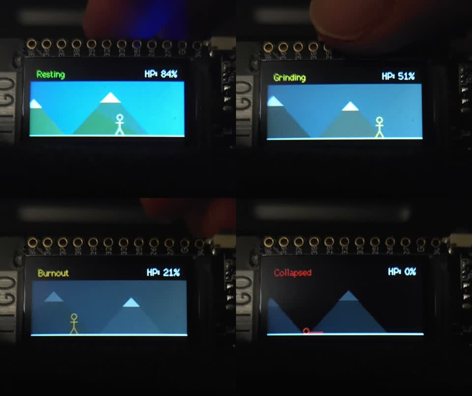

# Stick Man: Grinding and Burnout

Module 1 Generative Art Project for **COMS BC3930: Creative Embedded Systems** at Columbia University / Barnard College.  
Target hardware: **LilyGO TTGO T-Display ESP32** (ST7789 240×135 IPS display, capacitive touch, LiPo battery power).

---

## Visual Documentation

### Full Video Demonstration

https://github.com/user-attachments/assets/3be8f6ab-47e6-4042-87f7-cedefee3bc50

*Above: Live hardware demonstration on the LilyGO TTGO T-Display ESP32 illustrating capacitive touch interaction, sprinting cadence, stamina depletion, procedural environmental desaturation, collapse, and GPIO0 revival.*

### 4-Stage State Progression

*Above: Live hardware capture across the four interaction stages: Resting (top-left), Grinding (top-right), Burnout (bottom-left), and Collapsed (bottom-right).*

- Companion Blog Post: [Read the Design Blog Post on Website](https://akitoyamauchi.com/courses/creative-embedded-systems/module-1)

---

## Artistic Vision

This project offers an interactive critique of college "grind culture" and overwork, developed specifically for an installation hanging inside Columbia's Milstein Center, where there is a library where students pull exhausting all-nighters.

In competitive academic environments, constant motion is often conflated with meaningful progress. We celebrate late nights and endless cramming while overlooking the physiological and mental toll. This installation makes the audience complicit in that cycle:

- **Touch as External Pressure:** Holding the wire literally represents applying pressure to the student. When a viewer touches or holds the capacitive wire, they apply external pressure (deadlines, academic expectations) directly onto the student.
- **The Grinding Response:** Under touch, the stick figure sprints faster and the mountains rush by. To an outside observer, this looks like high productivity.
- **Hidden Depletion:** Beneath the surface, the student's internal energy (HP) drains rapidly.
- **Burnout and Decay:** Once energy drops to 30% or below, the student hits Burnout, slowing down to a limp while the vibrant world desaturates into a bleak charcoal gloom.
- **The Ethical Realization:** The underlying realization is that **we need intentional non-intervention and rest**. The viewer must actively choose to stop applying pressure and let the restorative transition take place.
- **The Reset Button:** Pressing the onboard button (GPIO0) resets the figure back to 100% HP. This mimics how university culture treats burnout, patching it over with coffee or a semester break, only to repeat the exact same cycle.

---

## State Machine & Visual Progression

| Stage | Trigger Condition | Motion Speed | Sky Color | Mountains & Peaks | Stickman State |
|---|---|---|---|---|---|
| **Resting** | Touch released (HP > 30%) | 2 px/frame (steady pace) | `0x22F5` (Vibrant twilight blue) | Forest green & pine (`0x2408` / `0x1B05`), snow cap (`0xFFFF`) | White, walking steadily |
| **Grinding** | Touch active (HP > 30%) | 4 px/frame (sprinting) | `0x324A` (Faded dusty slate) | Desaturated slate-brown (`0x4226` / `0x3184`), pale cap (`0xCE59`) | Warning Yellow, rapid running |
| **Burnout** | Stamina low (HP ≤ 30%) | 1 px/frame (slow limp) | `0x18C3` (Charcoal gloom) | Dark charcoal (`0x2104` / `0x18C2`), dim cap (`0x8410`) | Strained Orange, limping |
| **Collapsed** | Energy depleted (HP ≤ 0%) | 0 px/frame (stopped) | `0x0000` (Pitch black void) | Faint shadow silhouettes (`0x1082` / `0x0841`), dim cap (`0x2104`) | Red, collapsed flatline on ground |

---

## Key Design Decisions

1. **Procedural Geometry Over Static Bitmaps:** Rather than cycling pre-rendered GIF frames or static images, the visual system is entirely generated in code using vector primitives (`fillTriangle`, `drawCircle`, `drawLine`, `drawFastHLine`). The mountain positions scroll with dynamic sub-pixel offsets tied directly to current running velocity.
2. **The Sisyphus Mountain Metaphor:** Endless scrolling mountain peaks represent relentless academic milestones. No matter how fast you sprint, the horizon never arrives: one summit only leads to the next peak.
3. **Stage-Based Desaturation:** As energy depletes, the entire environment progressively loses its color saturation and brightness. The loss of vitality is not just internal to the character; it bleeds into the perception of the surrounding world.
4. **Asymmetric Energy Recovery:**
   - Stamina drains at `0.30` HP/frame during normal touch, and accelerates to `1.00` HP/frame if touched during Burnout.
   - Stamina recovers at only `0.10` HP/frame during resting, and crawls at `0.03` HP/frame during Burnout.
   - This asymmetry makes burnout easy to fall into and painful to climb out of, accurately reflecting physiological burnout.

---

## Technical Challenges & Solutions

### 1. Capacitive Touch Noise & Auto-Calibration
- **Issue:** Environmental humidity and individual touch capacitance vary widely. If a user was touching the wire when the ESP32 booted, a fixed threshold would fail.
- **Solution:** At startup, `calibration()` averages 50 successive readings from GPIO32 using `touchRead(32)` to establish an ambient baseline, setting the dynamic touch threshold at 75% of that baseline. An on-screen prompt guides the user during calibration.

### 2. State Persistence vs. Instantaneous Inputs
- **Issue:** Initially, releasing touch immediately flipped the state back to walking, meaning a figure with 5% HP would walk happily as if fully recovered.
- **Solution:** Energy was decoupled from instantaneous touch input. The `Burnout` state persists whenever HP ≤ 30%, forcing the character to limp in the dark while slowly regenerating stamina until reaching healthy thresholds.

### 3. Display Refresh & Ghosting on ST7789
- **Issue:** On the 240×135 display, longer text strings like `"Burnout"` left residual ghost characters when replaced by shorter strings like `"Resting"` or `"Collapsed"`. Furthermore, large fonts caused the `%` sign to clip off the right edge.
- **Solution:** 
  - Standardized on Font 2 (16px height).
  - Explicitly cleared the top UI banner (`tft.fillRect(0, 0, 240, 25, TFT_BLACK)`) before each render.
  - Anchored the state string to `(10, 6)` using `TL_DATUM` and right-aligned the HP string to `(230, 6)` using `TR_DATUM`, guaranteeing a consistent 10px margin from the screen bezel.

### 4. Strict Code Economy
- All generative math, procedural animation, touch sensing, UI rendering, and state management fits into **~155 lines of clean, readable Arduino C++** without external graphics frameworks.

---

## Hardware Configuration & Pinout

| Component | Pin | Purpose |
|---|---|---|
| **ESP32 Core** | Dual-core Tensilica Xtensa 240 MHz | Real-time loop execution |
| **ST7789 IPS Display** | SPI (built-in TTGO wiring) | 240×135 color display |
| **Capacitive Touch** | GPIO 32 | Sensor wire for user touch input |
| **Action Pushbutton** | GPIO 0 (active LOW) | Recalibrate sensor / revive after collapse |
| **Power Supply** | JST 2.0 mm / USB-C | 3.7V LiPo battery for envelope installation |

---

## How to Build and Run

1. Open the Arduino IDE.
2. Install the **ESP32** board package by Espressif (`Tools > Board > Boards Manager`).
3. Install the **TFT_eSPI** library by Bodmer (`Tools > Manage Libraries`).
4. In your Arduino libraries folder, configure `TFT_eSPI/User_Setup_Select.h` to include `#include <User_Setups/Setup25_TTGO_T_Display.h>`.
5. Open [`Project_1.ino`](Project_1.ino).
6. Connect the LilyGO TTGO T-Display via USB-C. Select board **ESP32 Dev Module** and the correct serial port.
7. Upload the sketch. Keep your fingers off GPIO32 during the 1-second startup calibration.
